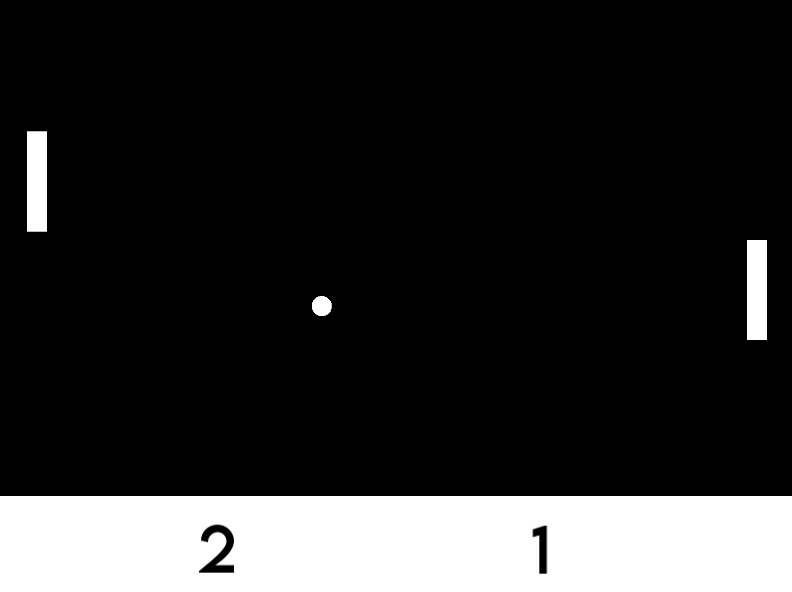

# Pong

A classic Pong game implementation built with C++ and SFML.

## Description

This is a recreation of the classic pong game. This is my first c++ project so I wanted to learn by using the SFML library. This game recreates the smooth gameplay physics that were found in the original pong. 

##Gameplay Demo (click image belw and download raw for short video demo)

[](./pong.mp4)


## Features

- Classic Pong gameplay mechanics
- Smooth ball and paddle physics
- Score tracking
- Downloaded fonts for UI elements

## Prerequisites

Before building this project, ensure you have the following installed:

- **CMake** (version 3.10 or higher)
- **C++ Compiler** with C++11 support or higher
  - GCC 7+ / Clang 5+ / MSVC 2017+
- **SFML 2.6.2** (add into the `external` directory)

## Project Structure

```
Pong/
├── assets/
│   └── fonts/          # Font files for text rendering
├── include/            # Header files
├── src/                # Source files
├── external/           # External libraries (e.g., SFML)
├── CMakeLists.txt      # CMake build configuration
└── .gitignore

```

## Building the Project

### Clone the Repository

```bash
git clone https://github.com/ReidVogel8/Pong.git
cd Pong
```

### Build with CMake

#### On Linux/macOS:

```bash
mkdir build
cd build
cmake ..
make
```

#### On Windows:

```bash
mkdir build
cd build
cmake ..
cmake --build . --config Release
```

### Run the Game

After building, the executable will be located in the `build` directory:

```bash
./Pong  # Linux/macOS
Pong.exe  # Windows
```

## Controls

- **Player 1 (Left Paddle)**: W (up) / S (down)
- **Player 2 (Right Paddle)**: Arrow Up / Arrow Down
- **E**: Exit game

## Gameplay

Just like the Atari pong, get the ball pass your opponents paddle to outscore them. 

## Development

### Technologies Used

- **C++**: Core programming language
- **SFML 2.6.2**: Graphics, window management, and input handling
- **CMake**: Build system

## Future Enhancements

Potential features to add:
- AI opponent for single-player mode
- Sound effects and background music
- Power-ups and special abilities
- Difficulty levels
- Menu system
- Multiplayer over network

## Acknowledgments

- Original Pong game by Atari (1972)
- SFML development team


Enjoy playing Pong!
